# Слоўнік

**абр_о_ць** !(пыса)  
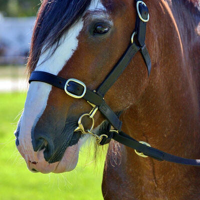 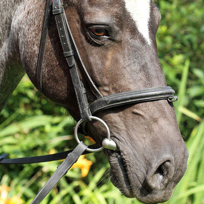 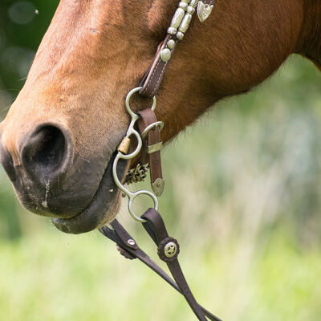 

**абр_у_с** !(талерка)  
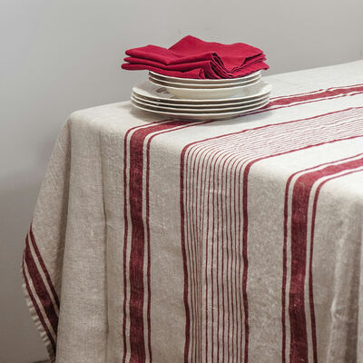 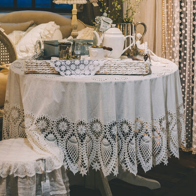 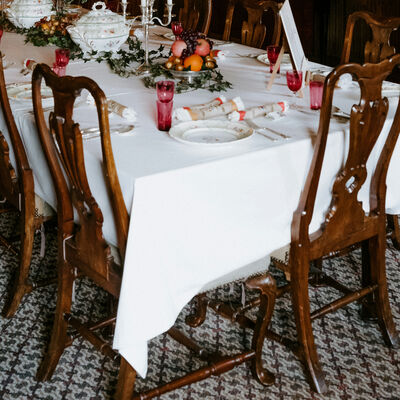 

**абц_а_с** !(боты)  
   

**абцуг_і_**   
 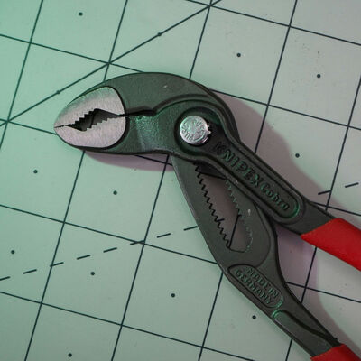  

**агр_э_ст**   
   

**агур_о_к**   
 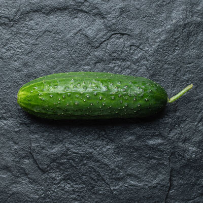  

**адр_ы_на**   
Не знайшоў фоткі

**аж_ы_ны**   
   

**акул_я_ры**   
 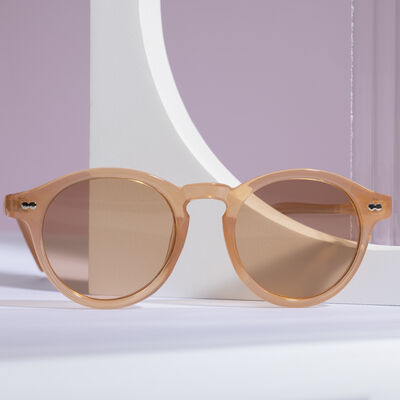  

**ал_е_й**   
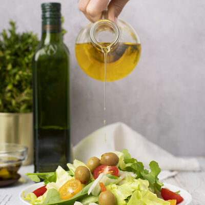   

**ал_о_вак**   
   

**альт_а_нка**   
 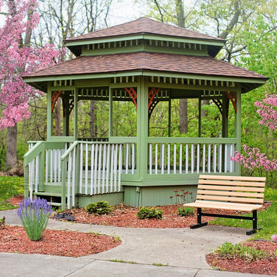  

**ан_ё_л**   
   

**апал_о_нік**   
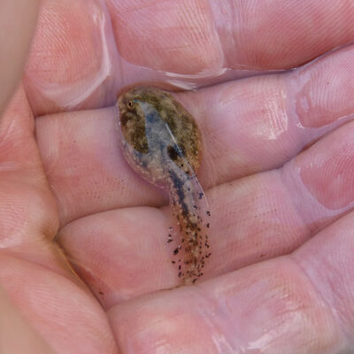  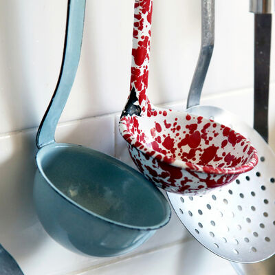 

**_а_ркуш** !(асадка)  
   

**ар_э_лі**   
   

**ас_а_дка** !(аркуш)  
   

**аск_е_пак**   
   

**баг_о_ўка**   
   

**бзьдз_ю_ль**   
Не знайшоў фоткі

**біз_у_н** !(кола)  
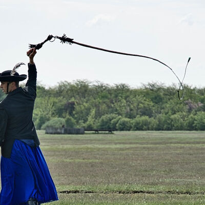 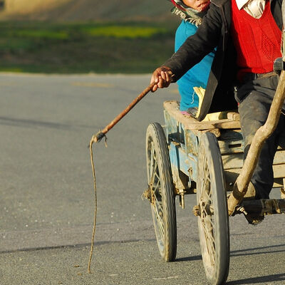 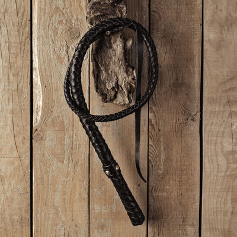 

**бір_у_лька**   
   

**бл_а_зан**   
   

**бліскав_і_ца**   
Як адрозьніць ад "маланкі"?

**б_о_ты**   
   

**б_о_хан**   
   

**бразг_о_тка**   
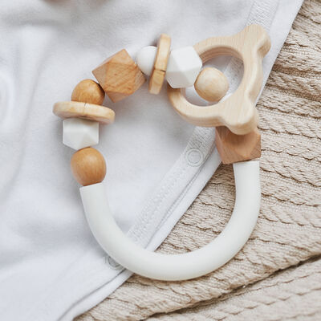  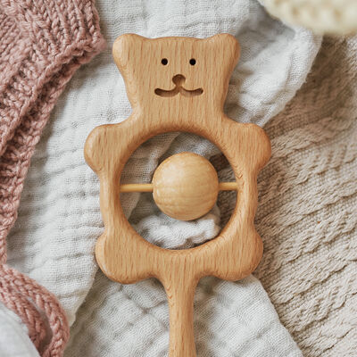 

**бр_о_сьня**   
Не знайшоў фоткі

**бр_у_д** !(талерка, ровар)  
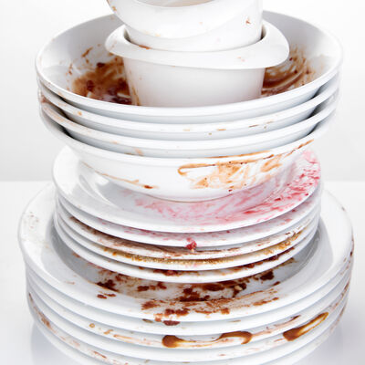 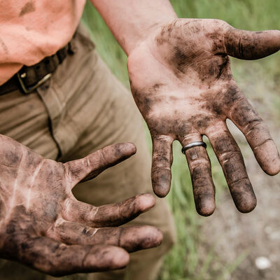 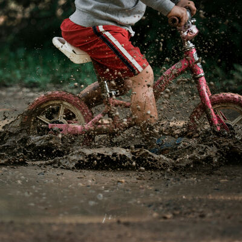 

**бр_ы_ль**   
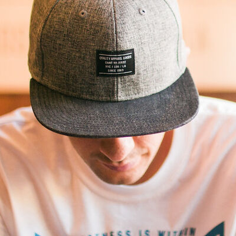 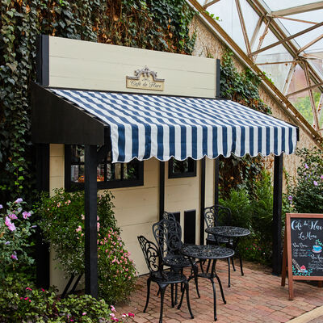 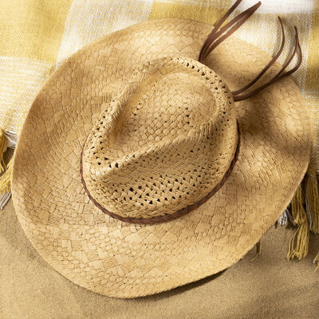 

**б_у_льба**   
   

**бур_а_к**   
   

**б_у_рбалкі**   
   

**буршт_ы_н**   
   

**б_у_сел**   
   

**б_э_з**   
   

**вав_ё_рка**   
   

**ваз_о_к**   
   

**вал_і_зка**   
   

**вал_о_шка**   
   

**вандр_о_ўнік**   
Не знайшоў фоткі

**в_е_жа**   
   

**в_е_йкі**   
  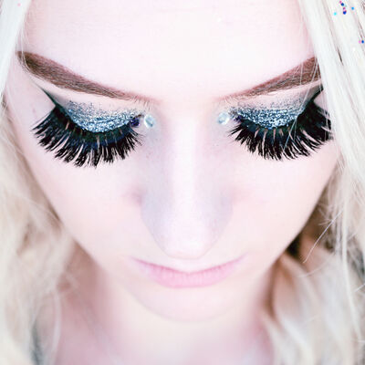 

**в_е_тразь**   
   

**від_э_лец**   
   

**в_о_гнішча** !(полымя, грубка)  
   

**в_о_ка** !(раёк, зрэнка)  
 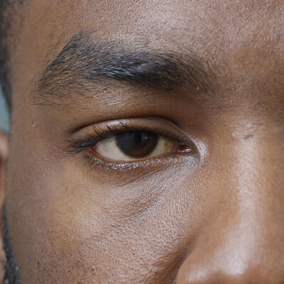 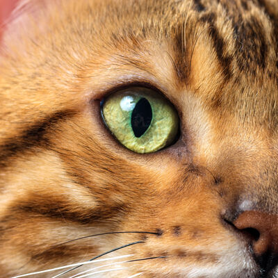 

**в_о_пратка**   
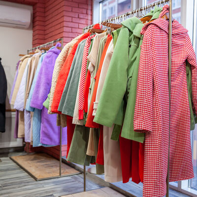 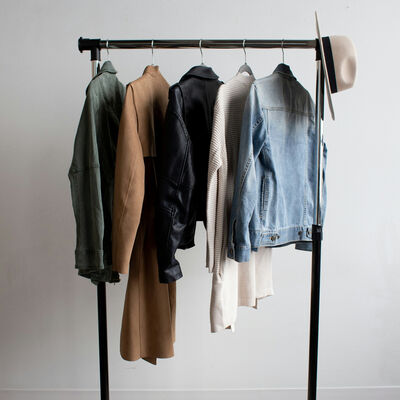  

**в_у_сы**   
   

**в_ы_спа**   
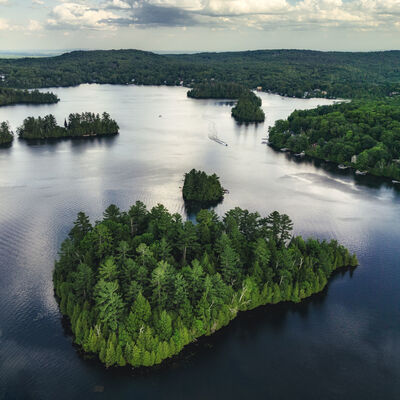   

**выцін_а_нка**   
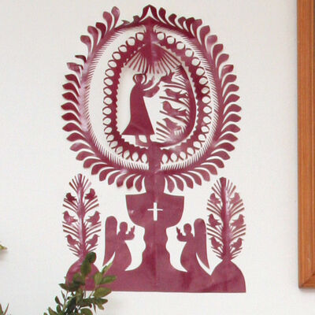 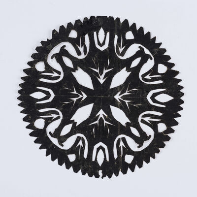 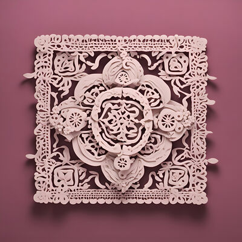 

**в_э_люм**   
   

**вяс_ё_лка**   
   

**вях_о_тка**   
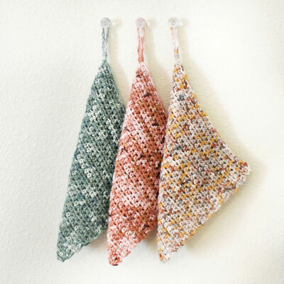   

**габл_ю_шка**   
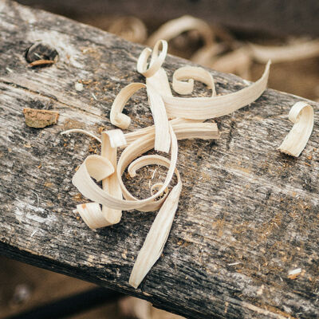 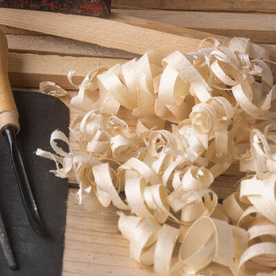 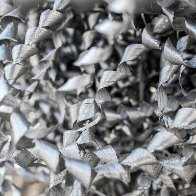 

**гадз_і_ньнік**   
   

**г_а_льштук**   
   

**гаман_е_ц**   
   

**г_а_нак**   
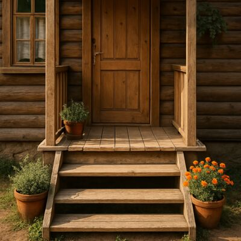   

**гарб_а_та**   
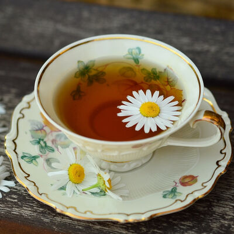   

**гарб_у_з**   
   

**гарл_а_чык**   
   

**гар_о_дніна**   
   

**гарс_э_т**   
 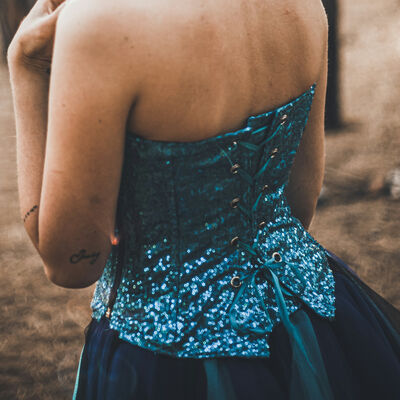  

**г_і_ль**   
   

**гл_я_йцар** !(корак)  
   

**гр_о_шы** !(слоік)  
   

**гр_у_бка** !(полымя, вогнішча)  
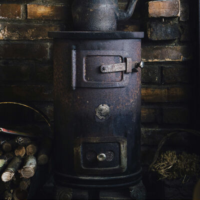 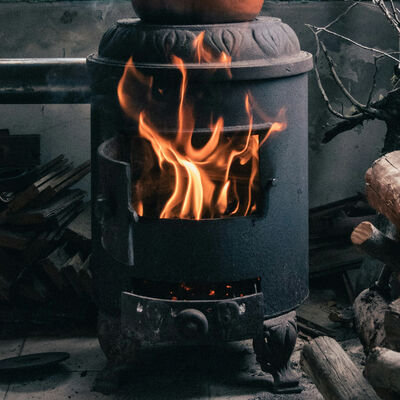 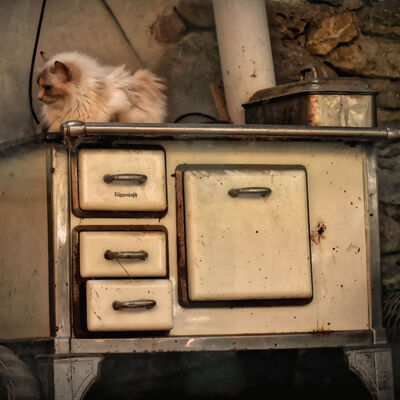 

**гр_у_ца**   
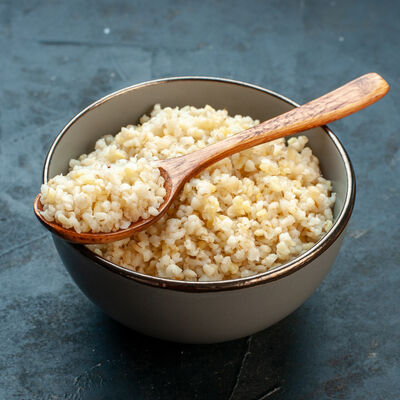 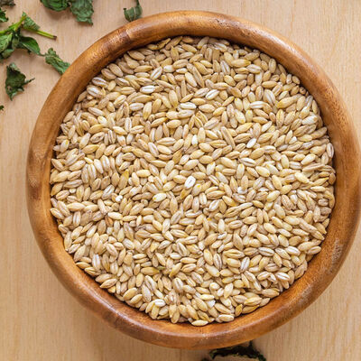 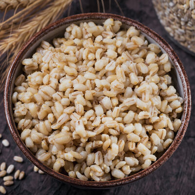 

**г_у_зік**   
   

**г_у_мка**   
   

**г_э_бель**   
   

**д_а_х**   
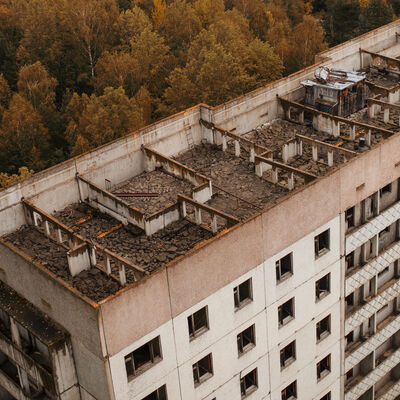   

**дз_е_жка**   
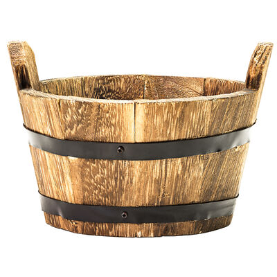 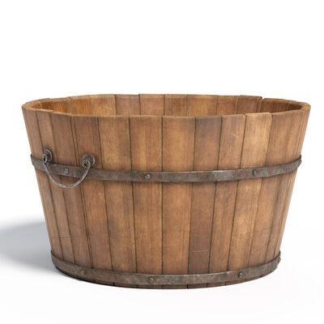 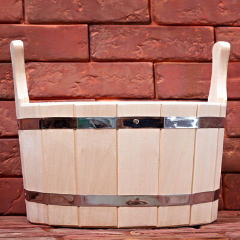 

**дз_ё_ньнік**   
як недвухсэнсоўна паказаць?

**дз_і_к**   
   

**дзьмухав_е_ц**   
   

**дз_я_га**   
Канфлікт з "пас", "папруга", "рэмень"

**драб_і_ны**   
   

**др_о_т**   
   

**друк_а_рка**   
   

**друк_а_рня**   
не знайшоў фота

**дрыгв_а_**   
   

**дыв_а_н**   
   

**дыям_э_нт**   
   

**жаўн_е_р**   
Не знайшоў фотка якія б мне спадабаліся

**жв_і_р**   
   

**журав_і_ны**   
   

**жыранд_о_ль**   
   

**зав_е_я**   
Канфлікт з "завіруха"

**завір_у_ха**   
Канфлікт з "завея"

**зап_а_лка** !(полымя)  
   

**запальн_і_чка** !(полымя)  
   

**запл_е_чнік**   
   

**зб_а_н**   
   

**зб_о_жжа** !(груца)  
   

**збр_о_я**   
   

**згр_а_я**   
   

**зд_а_нь**   
   

**з_е_ўра**   
Не прыдумаў як перадаць

**з_ё_лкі**   
   

**з_о_рка**   
   

**зр_э_нка** !(раёк, вока)  
   

**зьн_і_чка**   
Не знайшоў фоткі

**з_э_длік**   
   

**_і_мбрык**   
Я больш ня ўпэўнены што знычыць гэтае слова

**_і_рты**   
Ці сапраўды слова ўжываецца?

**к_а_ва**   
   

**кав_а_дла**   
   

**кав_у_н**   
   

**каж_а_н**   
   

**к_а_йстра**   
? як адрозьніць ад іншых торбаў?

**калаўр_о_т**   
   

**кал_я_ды**   
   

**кам_е_ль**   
   

**каміз_э_лька**   
   

**кам_і_н** !(полымя)  
   

**кан_а_па**   
   

**капял_ю_ш** !(брыль)  
   

**караг_о_д**   
   

**к_а_рак**   
   

**кар_а_лі**   
   

**кар_у_нкі**   
   

**к_а_ўка**   
   

**каўн_е_р**   
   

**к_а_фля**   
   

**кач_а_лка**   
   

**к_а_чка**   
   

**кв_е_тка**   
   

**к_е_ліх**   
   

**ків_а_ч**   
Не знайшоў фоткі

**кі_ё_к**   
   

**кіпцюр_ы_**   
   

**кіш_э_ня**   
   

**кі_я_х**   
   

**км_і_н**   
цяжка перадаць малюнкам

**кн_о_т**   
Не знайшоў фоткі

**к_о_ла**   
   

**к_о_мін**   
   

**к_о_наўка**   
Не знайшоў фоткі

**к_о_нік**   
   

**к_о_рак**   
   

**к_о_ўдра** !(ложак)  
   

**к_о_ўзанка**   
   

**к_о_шык**   
   

**кр_а_ткі**   
Не знайшоў фоткі

**кр_о_к**   
цяжка перадаць малюнкам

**кр_о_пка**   
не знайшоў малюнкаў

**круж_э_лка**   
   

**кр_ы_га**   
   

**крыгах_о_д**   
Не знайшоў фоткі

**кр_э_йда**   
   

**к_у_бак**   
   

**кудз_е_ркі**   
   

**к_у_фаль**   
   

**к_у_фар**   
   

**л_а_зьня**   
   

**ланц_у_г**   
   

**лас_у_нак**   
Як наогул можна відавочна паказаць?

**лін_а_рка**   
   

**літ_а_ра**   
   

**ліхам_а_нка**   
цяжка перадаць малюнкам

**ліхт_а_р**   
   

**ліхт_а_рык** !(прамень)  
   

**л_о_жак**   
   

**л_о_кшына**   
   

**луск_а_**   
   

**л_у_ста**   
   

**люст_э_рка**   
   

**лядз_я_к**   
   

**ляз_о_**   
   

**л_я_лька**   
   

**л_я_мец**   
   

**м_а_йткі**   
   

**маладз_і_к**   
Не знайшоў фоткі

**мал_а_нка**   
Канфлікт з бліскавіцай

**мал_ю_нак**   
   

**м_а_па**   
   

**матузк_і_**   
   

**м_о_гілкі**   
   

**мур_а_ш**   
   

**мут_э_рка**   
Не знайшоў фоткі

**м_ы_ліца**   
   

**м_я_тлік**   
   

**навальн_і_ца**   
Не знайшоў фоткі, і магчымы канфлікт з "бліскавіцай"/"маланкай"

**нажн_і_цы**   
   

**нал_е_пка**   

**нам_ё_т**   
   

**нам_ы_зьнік** !(пыса)  
   

**нач_о_ўка**   
двухсэнсоўнае?

**немаўл_я_**   
   

**н_і_тніца**   
   

**няб_о_жчык**   

**падаб_а_йка**   
   

**падар_у_нак**   
   

**падр_у_чнік** !(стос)  
   

**пал_і_ца** !(вопратка, шафа)  
   

**пальч_а_ткі**   
   

**панч_о_хі**   
   

**пап_е_ра**   
канфлікт з аркушом

**папр_у_га**   
Канфлікт шмат з чым

**парас_о_н**   
   

**пар_э_нчы**   
   

**пар_э_чкі**   
   

**пастар_у_нак**   
acab

**пат_ы_ліца**   
Не знайшоў фоткі

**пат_ы_ліца**   
   

**пат_э_льня**   
   

**пацал_у_нак**   
   

**п_а_церкі**   
   

**пац_у_к**   
   

**п_а_шпарт**   
   

**пашт_о_ўка**   
   

**п_е_вень**   
   

**п_е_рнік**   
Не знайшоў фоткі

**піг_у_лка**   
   

**пл_о_т**   
   

**пл_я_ма** !(бруд)  
   

**пл_я_шка**   
   

**п_о_лымя** !(вогнішча, грубка)  
   

**п_о_пел** !(вогнішча)  
   

**п_о_плаў**   

**п_о_рткі**   
Не знайшоў фоткі, і што наконт "нагавіцаў"?

**п_о_ўдзень**   

**п_о_ўнач**   

**п_о_ўня**   
   

**п_о_ўсьць** !(футра)  
   

**прам_е_нь**   
   

**пр_а_с**   
   

**прын_а_да**   
   

**пуст_э_льня**   
   

**пух_і_р**   
Не знайшоў фоткі

**п_ы_са** !(дзік)  
   

**п_э_ндзаль**   
   

**пял_ё_сткі**   
   

**пярл_і_на**   
Не знайшоў фотак асобных каб не канйліктавалі з "карáлямі"

**пярсьц_ё_нак**   
   

**рабац_і_ньне** !(вока, раёк)  
   

**раг_о_з**   
Не знайшоў фоткі

**ра_ё_к** !(вока, зрэнка)  
   

**раз_ы_нкі**   
   

**р_о_вар**   
   

**р_о_ндаль**   
   

**рыдл_ё_ўка**   
   

**рызьз_ё_**   
todo

**рыс_у_нак**   
Не знайшоў фоткі

**р_э_йкі**   
   

**с_а_жалка** !(качка)  
   

**с_е_нцы**   

**ск_а_лкі**   
Не знайшоў фоткі

**ск_а_рб** !(куфар, бульба)  
   

**скарб_о_нка**   
   

**ск_і_віца**   
   

**скр_о_нь**   
Не знайшоў фоткі

**скр_ы_ня**   
   

**слан_е_чнік**   
   

**слім_а_к**   
   

**сл_о_ік**   
   

**сл_о_ўнік**   
   

**смар_а_гд**   
   

**спадар_о_жнік**   
   

**спадн_і_ца**   
   

**сп_о_дак**   
   

**ст_а_нік**   
   

**ст_а_так**   
   

**ст_о_с**   
   

**стр_а_ўнік**   
   

**страх_а_** !(дах)  
   

**стр_о_й**   
Не знайшоў фоткі

**стр_о_ма**   
   

**стр_э_мка**   

**ст_у_дня**   
калодзеж?

**ст_у_жка**   
   

**стырн_о_**   
   

**суз_о_р'е** !(зорка)  
   

**сук_е_нка**   
Не знайшоў фоткі

**сум_ё_т** !(комін)  
   

**сун_і_цы**   
   

**сут_о_ка**   

**сх_о_ды**   
Не знайшоў фоткі

**сш_ы_так**   
Не знайшоў фоткі

**сьв_е_дка**   

**сьв_е_рдзел**   
   

**сьм_е_цьце**   
   

**сьціз_о_рык** !(лязо)  
   

**сьцягн_о_**   
   

**с_э_рца**   
   

**с_я_бар**   

**сяк_е_ра**   
   

**тал_е_рка** !(сподак)  
   

**т_а_рка**   
   

**трун_а_**   
   

**тр_у_с**   
   

**тр_у_скаўка**   
   

**трысьн_ё_г**   
Канфлікт з "чаротам"?

**усх_о_д**   

**фа_е_рка**   
   

**фат_э_ль**   
   

**фір_а_нкі**   
   

**футар_а_л**   
   

**ф_у_тра** !(поўсьць, пальчаткі)  
   

**хал_я_ва** !(боты)  
   

**хв_а_ля**   
   

**хмарач_о_с**   
   

**хр_у_шч**   
   

**х_у_стка**   
   

**царкв_а_**   
не знайшоў фоткі

**цм_о_к**   
   

**ц_у_кар**   
не знайшоў фоткі

**цук_е_рка**   
   

**цыб_у_ля**   
   

**цыр_а_та** !(абрус)  
   

**цьв_і_к**   
   

**цьв_і_ль**   
   

**ц_э_гла**   
   

**ц_э_тлік**   
   

**цягн_і_к**   
   

**цял_я_**   
   

**цясьн_і_на**   
   

**чарав_і_кі**   
   

**чарадзей:ка**   
   

**чарг_а_**   
   

**чар_о_т**   
Канфлікт з "трысьнягом"?

**ч_о_вен**   
   

**ш_а_лі**   
   

**ш_а_лік** !(хустка)  
   

**шалуп_і_ньне** !(бульба)  
   

**ш_а_фа** !(паліца, вопратка)  
   

**шаш_о_к**   
Чым дакладна адрозьніваецца ад "тхара"?

**шв_о_**   
   

**шв_о_рка**   
   

**шкарп_э_ткі**   
   

**шкл_о_**   

**шпал_е_ры**   
   

**шр_у_ба**   
   

**ш_у_флік**   
   

**шуфл_я_дка**   
   

**шчамл_ё_тка**   
   

**ш_ы_ба**   
Не знайшоў фоткі

**ш_ы_беніца**   
   

**шыд_э_лак**   
   

**шыпш_ы_на**   
   

**ш_э_рань**   
   

**электрав_і_к**   
Не знайшоў фоткі

**ядв_а_б**   
Не знайшоў як перадаць

**_я_йка**   
   

**ялав_е_ц**   
Не знайшоў як перадаць

**ял_і_на**   
Не знайшоў фоткі

